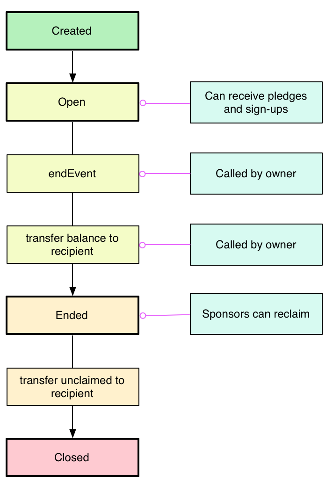

Sponsored Event
===

Create a sponsored event then manage funds and pledges through a smart contract.

This can be used to manage, collect and distribute donations for any kind of charity event – sponsored walk, climb, run, pogo-stick marathon, etc.

No more chasing people for money after the event. No need to worry about how or whether the money makes it to the charity. Partial completion (e.g. making it half-way around a course, only eating 0.5 million baked beans...) results in partial donation with the remainder returning to the original sponsor.

This contract also allows cancellation and withdrawal from the event. In that case, the participant's initial sign-up fee is transferred to the receiving charity but any pledges are returned to the sponsor.

Additional information about the event (description, title, images) should be stored off-chain in another database.

Web UI
===

Structure
===

Additional information such as event description, images, etc. should be stored in a separate database. The blockchain should only be used to manage the pledges.

Key Concepts
===

The Event
---

An event for charity where *someone* must complete all or part of *something*. In exchange *someone else* pledges to give money to a *recipient*.

The Recipient
---

The charity or body receiving the funds at the end. They don't need to do anything except have an account capable of receiving the funds.

The Organiser
---

The person creating the event specifying the name, date, description and designating the account of **The Recipient**. This account is the owner of **The Event**.

The Participant
---

The person actually taking part in **The Event**. This person signs up for the event and commits to taking part. They are given a unique URL which **The Sponsor** can use to pledge money. Participants are charged a sign-up fee.

The Sponsor
---

The source of the funds. This party has promised to donate money to **The Recipient** if **The Participant** takes part in The Event. They can include a message along with their pledge.

Cancellation
---

If the event is cancelled, all pledged money is automatically returned to **The Sponsor**. Sign-up fees are returned to **The Participant**.

Withdrawal
---

If **The Participant** withdraws, all money pledged to them is automatically available for **The Sponsor** to reclaim. The participant's sign-up fee is not returned.

Ending
---

**The Organiser** can mark an event as Ended. This will transfer completed pledges and sign-up fees to **The Recipient**.

Retrieval
---

Once the event has ended, **The Sponsor** is able to reclaim any funds donated to **Participants** who did not complete the event. The funds are not automatically returned as **The Event** may not have enough to cover the transaction fees.

Closing
---

After a period of time following the end of an event, **The Organiser** will close the event. This will transfer any remaining balance to **The Recipient**.

Contract Lifecycle
===

Order of Events
---

Organiser creates Event 
    (name, recipientName, recipientAddress) 
        -> EventId

Participant creates EventParticipant for EventId
    (EventId, participantName, participantAddress, entranceFee)
        -> EventParticipantId

Sponsor creates Sponsorship
    (amount, EventParticipantId, eventId)
        -> SponsorshipId

Organiser confirms completion of Participant 
    (EventParticipantId, percentage) or (EventId, ParticipantAddress, percentage)
        -> Event = getEvent(EventParticipantId.eventId)
        -> Lookup all sponsorshipId where EventParticipantId
        -> foreach Sponsorship
             transfer(percentage of Sponsorship.amount, Event.recipientAddress)
        -> transfer(entranceFee, Event.recipientAddress)

Developing
===

Start Ganache

Use this passphrase:

    circle cage glove rookie note valve naive garlic bacon suffer screen runway

MetaMask password:

    circlecage

After starting and connecting MetaMask, reset the account in Metamask

    MetaMask > Menu > Settings > Reset Account

Start Truffle:

    truffle console --network development

