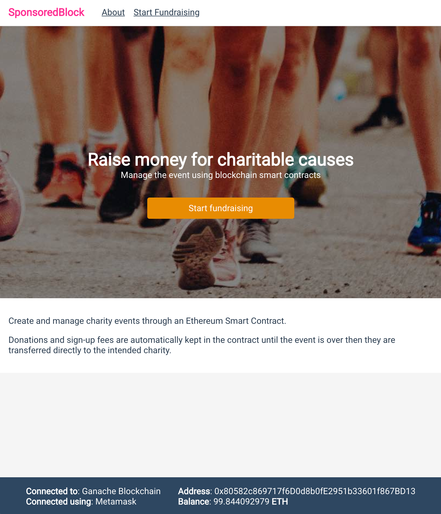
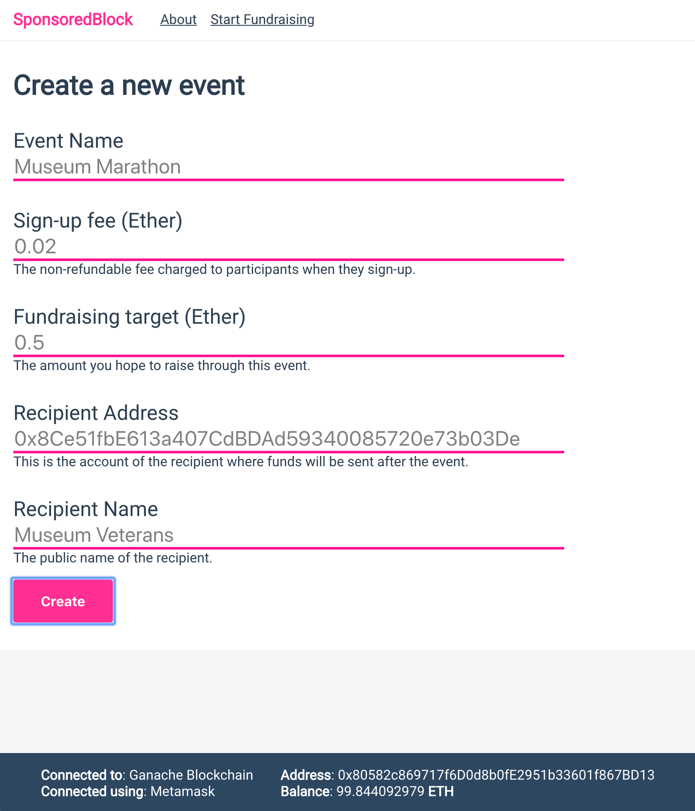
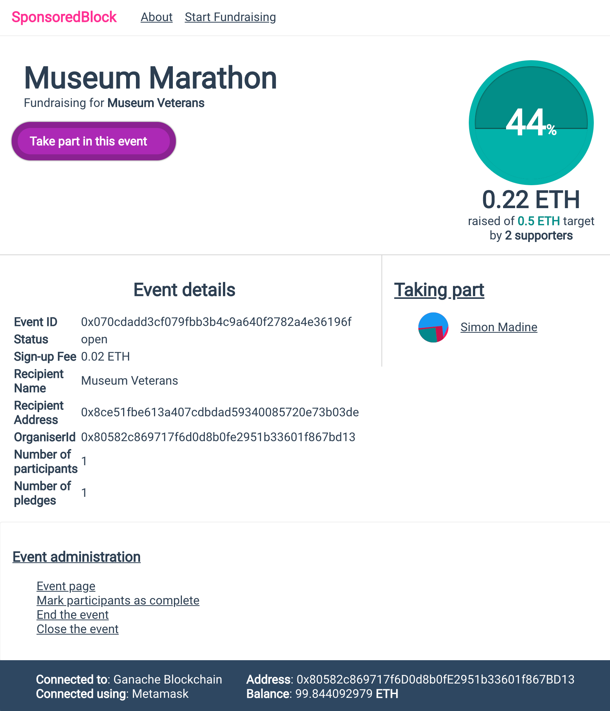
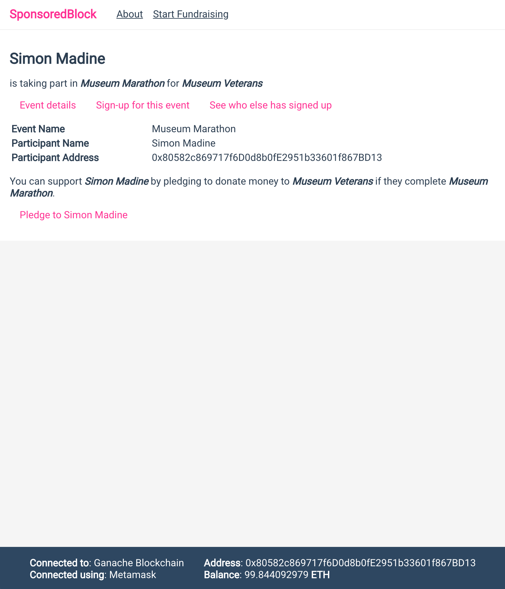
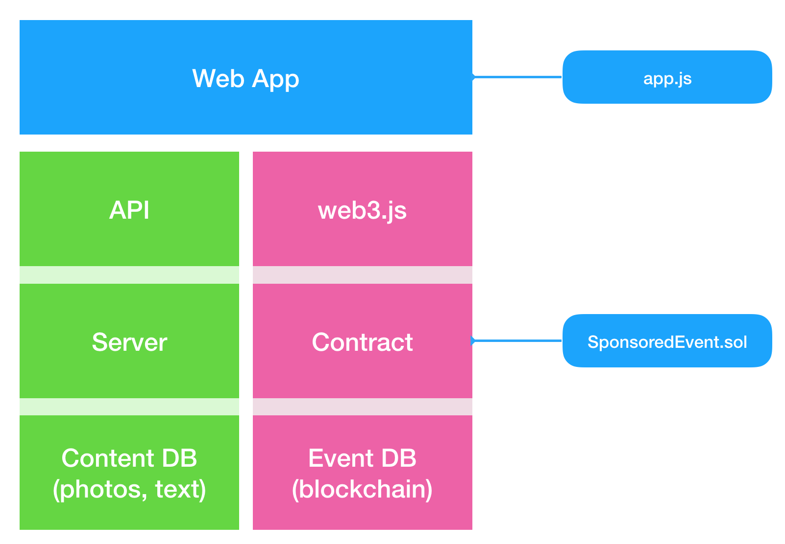
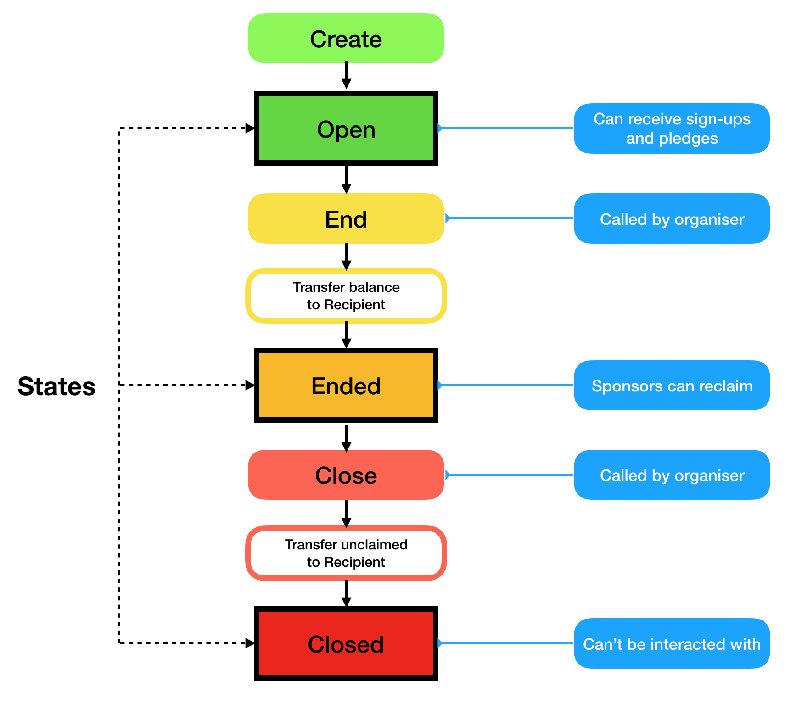

Sponsored Event
===

**NOTE: Don't actually try to use this on mainnet yet. It hasn't had nearly enough testing yet to be trusted with real money. Plus, the contract is too expensive to deploy.**

Create a sponsored event then manage funds and pledges through a smart contract.

This can be used to manage, collect and distribute donations for any kind of charity event – sponsored walk, climb, run, pogo-stick marathon, etc.

No more chasing people for money after the event. No need to worry about how or whether the money makes it to the charity.

This contract also allows cancellation and withdrawal from the event. In that case, the participant's initial sign-up fee is transferred to the receiving charity but any pledges are returned to the sponsor.

Additional information about the event (description, title, images) should be stored off-chain in another database.

---

Getting started
===

Install Truffle
---

    npm i -g truffle

Compile the contracts
---

    truffle compile

Install and Start Ganache
---

[https://www.trufflesuite.com/ganache](https://www.trufflesuite.com/ganache)

Start the development web server
---

    npm run dev

Screenshots
===

Web App Structure
===

The web app uses `web3.js` to interact with the smart contract `SponsoredEvent.sol`. It can also interact with a separate content database to keep as much non-critical data off the blockchain as possible.

---

Key Concepts
===

The Event
---

An event for charity where *someone* must complete all or part of *something*. In exchange *someone else* pledges to give money to a *recipient*.

The Recipient
---

The charity or body receiving the funds at the end. They don't need to do anything except have an account capable of receiving the funds.

The Organiser
---

The person creating the event specifying the name, date, description and designating the account of **The Recipient**. This account is the owner of **The Event**.

The Participant
---

The person actually taking part in **The Event**. This person signs up for the event and commits to taking part. They are given a unique URL which **The Sponsor** can use to pledge money. Participants are charged a sign-up fee.

The Sponsor
---

The source of the funds. This party has promised to donate money to **The Recipient** if **The Participant** takes part in The Event. They can include a message along with their pledge.

Cancellation
---

If the event is cancelled, all pledged money is automatically returned to **The Sponsor**. Sign-up fees are returned to **The Participant**.

Withdrawal
---

If **The Participant** withdraws, all money pledged to them is automatically available for **The Sponsor** to reclaim. The participant's sign-up fee is not returned.

Ending an event
---

**The Organiser** can mark an event as Ended. This will transfer completed pledges and sign-up fees to **The Recipient**.

Retrieval period
---

Once the event has ended, **The Sponsor** is able to reclaim any funds donated to **Participants** who did not complete the event. It is possible to implement push here so that funds are automatically returned but this carries risks as **The Event** may not have enough to cover the transaction fees. It's safer to implement a pull model here so that any fees are guaranteed to be covered.

Closing the contract
---

After a period of time following the end of an event, **The Organiser** will close the event. This will transfer any remaining balance to **The Recipient**.

Contract Lifecycle
===

Each **Sponsored Event** contract starts when **The Organiser** creates it and deploys it on the blockchain. From that point, **The Participants** can sign up and **The Sponsors** can make pledges.

